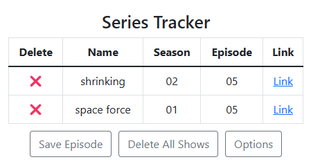

# Series Tracker Chrome Extension

Keeps track of your watch progress of all series on [SvetSerialu](https://svetserialu.io/).

## How to install

- Download and extract this project in an empty folder
- In your Chrome browser open chrome://extensions/
- Enable Developer mode
- Click on Load unpacked and select folder with extracted project

## How to use

- Open an episode of any shows on SvetSerialu
- Open extension and `Save Episode` button will be enabled and click it
- If you want to remove a show then just click on delete icon
- If you want to remove all shows, then just press `Delete All Shows` button

## Possible features

- Tracking shows on other websites
- Automatic saving episodes on page load